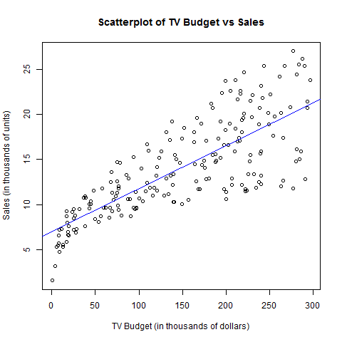

#Abstract

This report seeks to replicate the research found in *Simple Linear Regression*, chapter 3 of the book **An Introduction to Statistical Learning** by Gareth James, et al., on a set of advertising data.

#Introduction

The goal of this research is to use existing data to formulate a marketing plan that will result in higher product sales. To that end, we will run a linear regression to model the increase of sales against the amount of money spent on marketing the product. We will analyze this to determine how advertising affects sales, and how the company should budget for advertising in order to increase sales of the product.

#Data
The Advertising data set consists of the `Sales` (in thousands of units) of a particular product in 200 different markets, along with advertising budgets (in thousands of dollars) for the product in each of those markets for three different media: `TV`, `Radio`, and `Newspaper`. We work primarily with the `TV` data for this project, observing the effects of different levels of budget for TV advertising on the sales of units.

```{r, echo=T}
load('../data/regression.RData')
head(advertising)
```

#Methodology
We look at the relationship between `Sales` and `TV` budget using a simple linear model:

  `Sales = a + b * TV`

That is, we predict there to be a linear relationship between the amount of money spent on TV advertising and the number of sales of units. We approximate a and b using a linear regression under the least squares criterion.

#Results

We computed the correlation coefficients using the lm() function, with `TV` as a function of `Sales`. 

```{r, echo=T}
print('Table 1: Information about the Linear Regression')
ad_summ
```

The estimates of these coefficients, a and b, are 7.033 and .048, respectively; that is, for every $1,000 increase in spending on TV advertising, sales are projected to increase by 48 units. On average, data will deviate from the true regression model by 3.259. An R^2^ of .612, means 61.2% of the variability is explained by the model. An F-statistic of 312.1 means that the coefficients found by our model are very likely to be close to the true regression values.




#Conclusions
There is a positive correlation between the budget for TV advertising and Sales; however, this relationship is very minimal. For every $1,000 spent on advertising only another 48 units are sold, so each unit would have to cost at least $20.84 in order to break even or profit off the units sold. 
